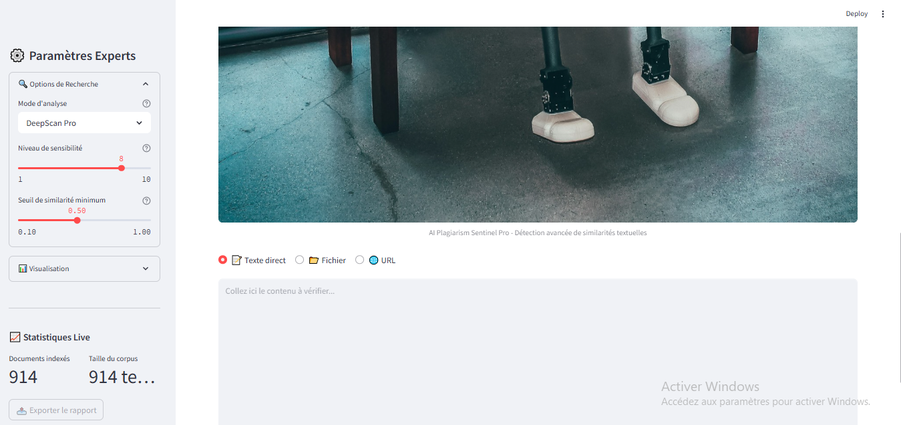
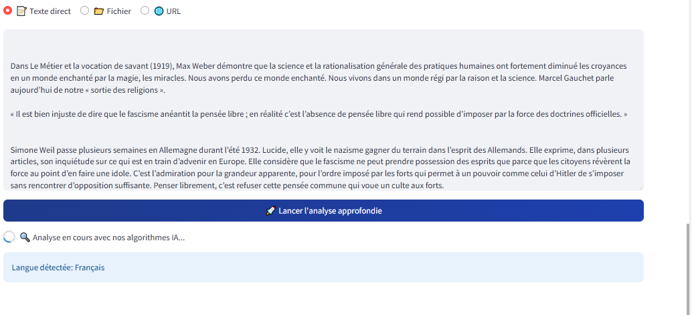
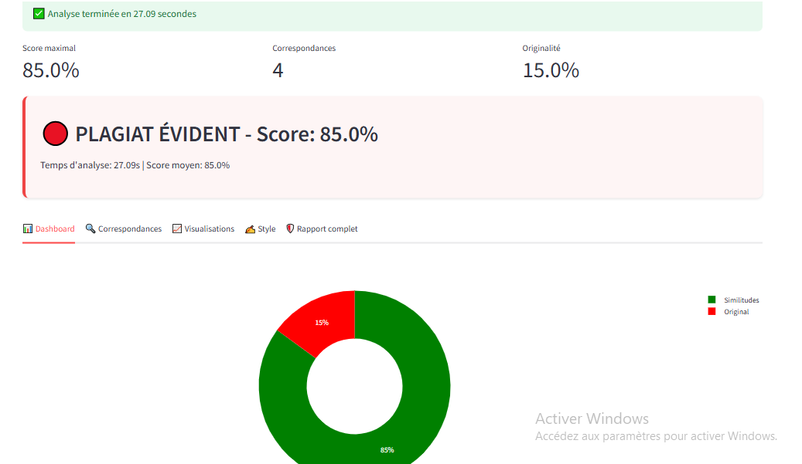
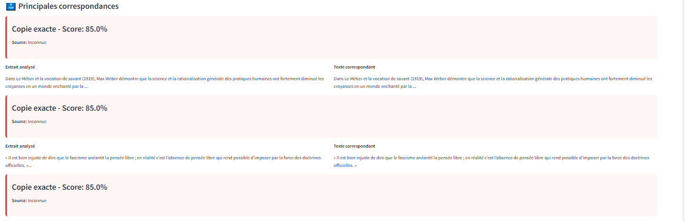
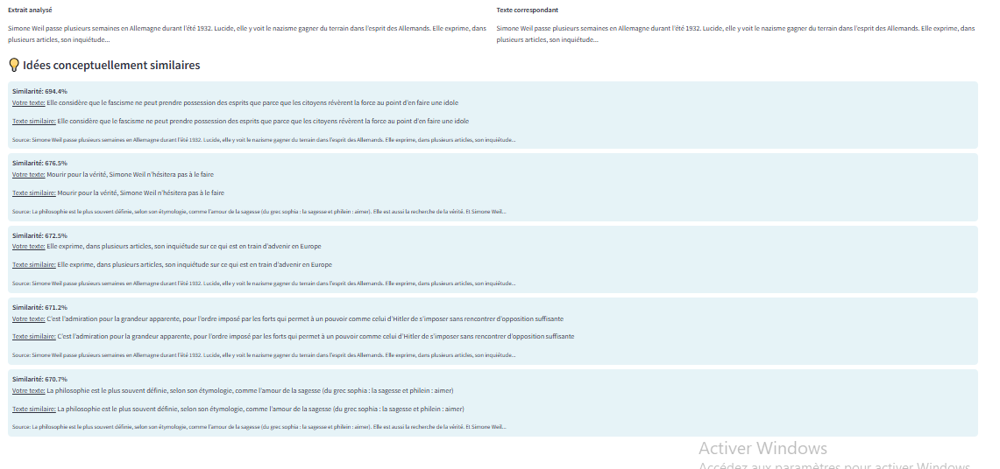
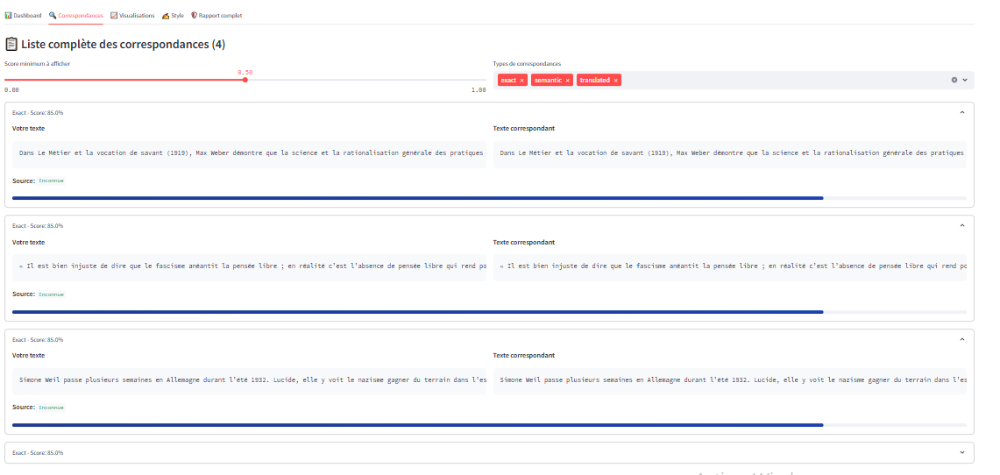
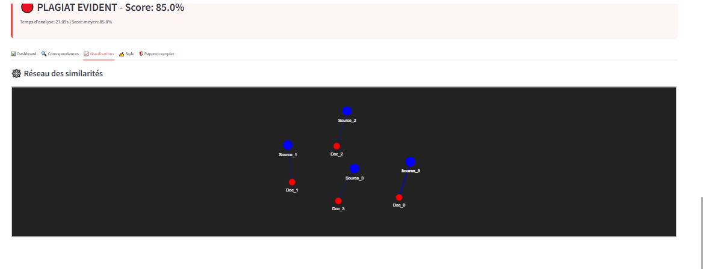
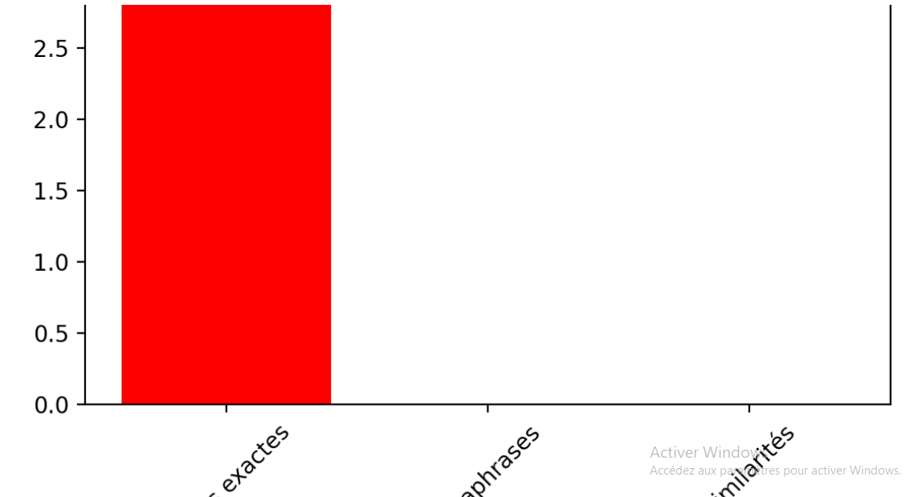
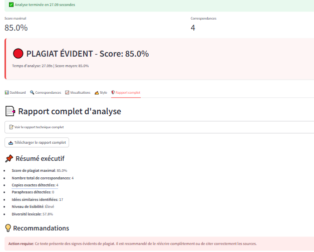

================================================
Documentation du projet IA de plagiarism checker
================================================

Bienvenue dans la documentation du projet Détection de plagiat par Intelligence Artificielle à l'aide de RAG et d'analyse sémantique avancée.Ce document détaille les méthodologies, les outils utilisés, ainsi que les résultats obtenus pour identifier les cas de plagiat, qu’ils soient exacts, paraphrasés ou sémantiquement similaires.L’objectif de ce projet est de développer un système de détection robuste en combinant plusieurs approches

Préparé par :
-------------
  **-Oussama Fahim**

  **-Fatima el Fadili**

Encadé par :
------------
    **- M.hajji**

Table des matières
------------------

- `Introduction <index.html#id1>`_
- `Objectifs du projet <index.html#id2>`_
- `Installation <index.html#id3>`_
- `Pipeline <index.html#id4>`_
- `Création d'une Base de Données Vectorielle <index.html#id5>`_
- `Application des Approches de Recherche Hybride <index.html#id6>`_
- `Création d'une interface streamlit <index.html#id7>`_ 
- `Résultats <index.html#id8>`_
- `Travaux Futurs <index.html#id9>`_
- `Conclusion <index.html#id10>`_

Introduction
============

La détection automatique du plagiat est devenue un enjeu crucial dans le monde académique et professionnel, où la vérification de l'originalité d'un contenu est essentielle à la crédibilité intellectuelle et à l’intégrité des travaux. 

Ce projet propose une solution intelligente et robuste de détection de plagiat en temps réel, exploitant les dernières avancées en **traitement du langage naturel (NLP)**, **recherche vectorielle**, et **modèles de similarité sémantique multilingue**.

En s’appuyant sur une combinaison d’**embeddings puissants**, de **moteurs de recherche hybride**, de **modèles cross-encoders**, ainsi que d’une **analyse stylistique avancée**, cette plateforme permet de détecter différents types de plagiat : copie exacte, paraphrase, similitude conceptuelle, ou correspondance multilingue.

Le tout est encapsulé dans une interface interactive développée avec **Streamlit**, offrant à l'utilisateur une expérience fluide, visuelle, et totalement explicable.

Objectifs du projet
===================

- **Fournir un système de détection de plagiat automatisé et intelligent** :
  
  - Basé sur une base vectorielle *Chroma* enrichie par des embeddings (*Ollama embeddings*).
  - Capable d’identifier non seulement des copies exactes, mais aussi des paraphrases et similitudes conceptuelles, y compris entre langues différentes (français/anglais).

- **Démontrer l’utilisation combinée de technologies modernes** :
  
  - 🧠 *LangChain*, *TF-IDF*, *Cross-Encoder* (MS-MARCO) pour l’analyse sémantique.
  - 📚 *SpaCy* et *textstat* pour l’analyse stylistique, lisibilité, structure grammaticale, diversité lexicale.
  - 📊 *Streamlit*, *Plotly*, *WordCloud*, *Pyvis* pour la visualisation avancée et l’explicabilité.

- **Assurer une analyse complète et interprétable** :
  
  - Génération d’un rapport technique JSON détaillé.
  - Résumé exécutif avec score global, alertes de plagiat, et recommandations.
  - Visualisation des correspondances (réseaux interactifs, nuages de mots, graphiques).

- **Garantir une expérience utilisateur professionnelle** :
  
  - Interface responsive avec personnalisation CSS.
  - Chargement de texte via saisie directe, fichiers (.pdf, .docx…), ou URL.
  - Téléchargement dynamique de rapports avec score et diagnostic.

Installation
============

Les bibliothèques suivantes sont nécessaires pour le projet :

1. **os** : Manipulation des fichiers et chemins.
2. **pickle** : Sérialisation et sauvegarde des objets Python.
3. **cv2** : Traitement d'images avec OpenCV.
4. **numpy** : Manipulation de matrices et calculs numériques.
5. **streamlit** : Interface web interactive pour l’utilisateur.
6. **langchain.vectorstores** : Gestion des bases vectorielles avec Chroma.
7. **langchain_community.embeddings** : Génération des embeddings avec Ollama.
8. **langdetect** : Détection automatique de la langue d’un texte.
9. **typing** : Annotations de types (`List`, `Dict`, etc.).
10. **time** : Gestion du temps (durée d’analyse, timestamps).
11. **pandas** : Manipulation et affichage de tableaux de données.
12. **difflib** : Comparaison de chaînes pour la similarité exacte.
13. **matplotlib.pyplot** : Visualisation de données.
14. **plotly.express** : Graphiques interactifs (camemberts, barres).
15. **collections.defaultdict** : Regroupement d’éléments similaires.
16. **re** : Expressions régulières pour le nettoyage de texte.
17. **hashlib** : Hachage des textes pour la détection exacte.
18. **sentence_transformers** : Calcul avancé de similarité sémantique (CrossEncoder).
19. **sklearn.feature_extraction.text** : TF-IDF vectorisation.
20. **sklearn.metrics.pairwise** : Similarité cosinus.
21. **PIL.Image** : Chargement et affichage d’images.
22. **requests** : Requête HTTP pour charger des images ou contenus.
23. **io.BytesIO** : Manipulation de contenu binaire.
24. **json** : Sérialisation JSON pour les rapports.
25. **networkx** : Création de graphes de similarité.
26. **pyvis.network** : Visualisation interactive de réseaux.
27. **tempfile** : Création de fichiers temporaires.
28. **spacy** : Analyse grammaticale et entités nommées.
29. **wordcloud.WordCloud** : Nuage de mots basé sur les correspondances.
30. **textstat** : Analyse de lisibilité.
31. **streamlit.components.v1.html** : Affichage de composants HTML personnalisés.
32. **docx2txt** : Extraction de texte depuis fichiers Word.
33. **PyPDF2** : Extraction de texte depuis fichiers PDF.
34. **base64** : Encodage d’images pour l’affichage CSS.
35. **annotated_text** : Mise en évidence de texte dans Streamlit.
36. **st_aggrid** : Tableaux interactifs dans Streamlit.
37. **ollama** : Requêtes vers un modèle de langage local.

.. code-block:: python

   import os
   import pickle
   import cv2
   import numpy as np
   import streamlit as st
   import time
   import pandas as pd
   import matplotlib.pyplot as plt
   import plotly.express as px
   import re
   import hashlib
   import json
   import tempfile
   import requests
   import base64
   import docx2txt
   import PyPDF2
   import networkx as nx
   from PIL import Image
   from io import BytesIO
   from difflib import SequenceMatcher
   from collections import defaultdict
   from typing import List, Dict, Any, Tuple
   from sentence_transformers import CrossEncoder
   from sklearn.feature_extraction.text import TfidfVectorizer
   from sklearn.metrics.pairwise import cosine_similarity
   from langchain.vectorstores import Chroma
   from langchain_community.embeddings import OllamaEmbeddings
   from wordcloud import WordCloud
   import spacy
   import textstat
   from streamlit.components.v1 import html
   from annotated_text import annotated_text
   from st_aggrid import AgGrid
   import ollama

pipeline
========

.. list-table::
   :widths: 200 200
   :align: center

   * - .. image:: image/1.png
         :alt: PIPLINE 
         :width: 700px
     - .. image:: image/2.png
         :alt: Image 2
         :width: 700px

**explication de pipline:**

*Phase 1: Préparation de la Base Vectorielle*

.. list-table::
   :header-rows: 1
   :widths: 10 30 60

   * - Étape
     - Outils/Méthodes
     - Description
   * - 1. Extraction
     - LlamaParse (FR/EN)
     - Conversion des PDF/DOCX en Markdown propre
   * - 2. Nettoyage
     - Regex + Unicode Normalization
     - Suppression des en-têtes, pieds de page, caractères spéciaux
   * - 3. Découpage
     - ``split('\\n\\n')``
     - Séparation en paragraphes (1 paragraphe = 1 document)
   * - 4. Embeddings
     - OllamaEmbeddings (mxbai-embed-large)
     - Vectorisation des paragraphes
   * - 5. Stockage
     - Chroma DB
     - Indexation avec métadonnées (source, langue)
   * - 6. Persistance
     - ``vecdb.persist()``
     - Sauvegarde locale dans ``philo_db``

*Phase 2: Analyse de Plagiat (Frontend/Backend)*

.. list-table::
   :header-rows: 1
   :widths: 10 30 60

   * - Étape
     - Outils/Méthodes
     - Description
   * - 1. Input Utilisateur
     - Streamlit (``file_uploader``/``text_area``)
     - Support pour texte direct, fichiers, ou URLs
   * - 2. Pré-processing
     - ``langdetect`` + ``spacy``
     - Détection de langue et nettoyage
   * - 3. Recherche Hybride
     - Combinaison de 3 méthodes:
     - 
   * - 
     - • **Exact Match** (MD5 + ``SequenceMatcher``)
     - Détection de copies mot-à-mot
   * - 
     - • **Semantic Search** (Ollama + Cross-Encoder)
     - Similarité conceptuelle (seuil: 0.4-1.0)
   * - 
     - • **Multilingue** (Traduction via Llama3)
     - Comparaison FR↔EN
   * - 4. Post-Traitement
     - ``networkx`` + ``pyvis``
     - Génération du réseau de similarité
   * - 5. Rapport
     - JSON + Streamlit
     - Export des résultats détaillés

Création d'une Base de Données Vectorielle 
==========================================

Ce guide fournit une procédure complète pour transformer un ou plusieurs fichiers PDF en une base de données vectorielle, utilisable notamment pour la détection de similarité textuelle ou de plagiat. L'approche repose sur l'utilisation combinée de **LlamaParse** pour l'extraction intelligente de texte structuré et de **LangChain** pour la vectorisation et la gestion des documents.

.. contents:: Sommaire
   :depth: 2
   :local:

**Étape 1 : Installation des Dépendances**

Cette première étape consiste à importer l'ensemble des librairies nécessaires au bon fonctionnement du pipeline. 

.. code-block:: python
   :linenos:

   import os
   from llama_parse import LlamaParse
   from llama_parse.base import ResultType
   from langchain.text_splitter import RecursiveCharacterTextSplitter
   from langchain.vectorstores import Chroma
   from langchain.embeddings import HuggingFaceEmbeddings
   from langchain_core.documents import Document
   from llama_cloud_services.parse.utils import Language
   from langchain_community.embeddings.ollama import OllamaEmbeddings

Les modules importés remplissent des rôles spécifiques :
- `llama_parse` permet d'extraire le contenu structuré des PDF (en Markdown ici).
- `langchain` permet de gérer la transformation du texte en vecteurs ainsi que leur stockage dans une base.
- `OllamaEmbeddings` fournit un modèle d'embedding performant pour convertir du texte en vecteurs numériques.

**Étape 2 : Configuration de l'API LlamaParse**

Avant de lancer l'extraction, il est nécessaire de configurer LlamaParse avec une clé API valide. On peut également spécifier la langue du document pour améliorer la précision de l’analyse.

.. code-block:: python
   :linenos:

   os.environ["LLAMA_CLOUD_API_KEY"] = "llx-a2C7FgYfP1hzX3pXuvtdaNmexAqsuRnJIJ2G6MjbBrfuS3QY"
   
   parser_fr = LlamaParse(
       result_type=ResultType.MD, 
       language=Language.FRENCH
   )
   parser_en = LlamaParse(
       result_type=ResultType.MD,
       language=Language.ENGLISH
   )

Deux parseurs sont initialisés ici : un pour les documents en français et un autre pour ceux en anglais. Le format de sortie sélectionné est le Markdown (`ResultType.MD`), ce qui permet de conserver la structure logique du document original (titres, paragraphes, listes, etc.).

**Étape 3 : Extraction du Contenu PDF**

On procède ensuite à l’extraction effective du contenu des fichiers PDF. LlamaParse utilisant des appels asynchrones, l’environnement doit être adapté pour gérer cela correctement.

.. code-block:: python
   :linenos:

   import nest_asyncio
   nest_asyncio.apply()

   pdf_files = [("philosophie.pdf", parser_fr)]
   
   with open("plagia_data.md", 'w', encoding='utf-8') as f:
       for file_name, parser in pdf_files:
           print(f"Traitement de {file_name}...")
           documents = parser.load_data(file_name)
           f.write(f"# Contenu extrait de : {file_name}\\n\\n")
           for doc in documents:
               f.write(doc.text + "\\n\\n")

Chaque fichier est traité indépendamment. Le texte extrait est structuré et stocké dans un fichier Markdown intermédiaire (`plagia_data.md`). Cela facilite les traitements ultérieurs, notamment pour la segmentation en paragraphes ou sections.

**Étape 4 : Préparation des Données**

Une fois le contenu extrait, il est lu depuis le fichier Markdown et segmenté en paragraphes. Ces derniers seront convertis en objets `Document`, reconnus par LangChain.

.. code-block:: python
   :linenos:

   with open("plagia_data.md", encoding='utf-8') as f:
       markdown_content = f.read()
   
   paragraphs = [p.strip() for p in markdown_content.split('\\n\\n') if p.strip()]
   documents = [Document(page_content=paragraph) for paragraph in paragraphs]

Chaque double saut de ligne est interprété comme une séparation logique entre les idées ou blocs de contenu. Cette segmentation est cruciale pour que les embeddings soient cohérents et représentatifs du contenu.

**Étape 5 : Génération des Embeddings**

Cette étape est centrale : elle convertit le texte en vecteurs numériques à l’aide d’un modèle d’embedding compatible avec LangChain. Ces vecteurs sont ensuite stockés dans une base Chroma persistante.

.. code-block:: python
   :linenos:

   embeddings = OllamaEmbeddings(model="mxbai-embed-large:latest")
   
   vecdb = Chroma.from_documents(
       documents=documents,
       embedding=embeddings,
       persist_directory="philo_db",
       collection_name="rag-chroma"
   )
   vecdb.persist()

Le modèle utilisé ici, `mxbai-embed-large:latest`, encode chaque paragraphe en un vecteur dense de 1024 dimensions. Ces vecteurs sont ensuite indexés et sauvegardés localement dans un dossier nommé `philo_db`. La collection `rag-chroma` permet de regrouper les documents selon un même thème ou usage.

**Résultats**

À l'issue de ce processus, une base vectorielle est constituée à partir du contenu textuel extrait.

.. code-block:: text

   Opération terminée avec succès:
   - 914 paragraphes traités
   - Base vectorielle sauvegardée dans: philo_db

Cette base peut désormais être utilisée pour la recherche sémantique, la détection de plagiat ou l’implémentation d’un système RAG (Retrieval-Augmented Generation).

**Notes Techniques**

- *Format des embeddings* : chaque paragraphe est transformé en un vecteur de 1024 dimensions, ce qui garantit une bonne expressivité sémantique.
- *Taille moyenne des paragraphes* : entre 150 et 300 mots, ce qui est optimal pour les modèles d’embedding modernes.
- *Métadonnées* : il est possible d’ajouter des métadonnées à chaque `Document` (par exemple la langue, l’origine du fichier, la section du document, etc.) pour des filtres ou recherches avancées.

**Conclusion**

Ce guide constitue une base robuste pour créer une base vectorielle à partir de documents PDF multilingues. Il est facilement extensible pour inclure plus de fichiers, enrichir les métadonnées ou intégrer des systèmes de recherche sémantique avancée.

Application des Approches de Recherche Hybride
==============================================

.. contents:: 
   :depth: 3
   :local:

**Introduction**

La recherche hybride combine plusieurs techniques de similarité textuelle pour détecter le plagiat à différents niveaux :

1. **Recherche exacte** : Détection de copies mot-à-mot
2. **Similarité sémantique** : Identification des paraphrases
3. **Analyse multilingue** : Comparaison entre langues (FR↔EN)

**Architecture Principale**

.. image:: image/3.png
   :alt: architecture de la recherche hybride
   :width: 400px

**Fonctions Clés**

**check_exact_match()**

.. code-block:: python
   :linenos:
   :emphasize-lines: 3-5,12-15

   def check_exact_match(input_text: str, dataset: List[str]) -> List[Tuple[str, float]]:
    """Vérifie les correspondances exactes avec normalisation avancée"""
    def normalize(text):
        text = re.sub(r'[^\w\s]', '', text.strip().lower())
        return re.sub(r'\s+', ' ', text)
    
    normalized_input = normalize(input_text)
    input_hash = hashlib.md5(normalized_input.encode('utf-8')).hexdigest()
    matches = []
    
    for doc in dataset:
        normalized_doc = normalize(doc)
        doc_hash = hashlib.md5(normalized_doc.encode('utf-8')).hexdigest()
        
        if input_hash == doc_hash:
            return [(doc, 1.0)]
        
        # Similarité textuelle indépendante de la langue
        match_ratio = SequenceMatcher(None, normalized_input, normalized_doc).ratio()
        if match_ratio > 0.7:
            matches.append((doc, match_ratio))
        
        # Vérification des segments longs
        input_words = normalized_input.split()
        doc_words = normalized_doc.split()
        
        for i in range(len(input_words) - 8 + 1):  # Fenêtre de 8 mots
            segment = ' '.join(input_words[i:i+8])
            if segment in normalized_doc:
                matches.append((doc, max(match_ratio, 0.85)))
                break
    
    unique_matches = {match[0]: match[1] for match in matches}
    return sorted(unique_matches.items(), key=lambda x: x[1], reverse=True) 
   

*Explication* : 

La fonction `check_exact_match` a pour objectif de détecter des correspondances exactes ou partielles entre un texte d'entrée (`input_text`) et les documents d'un ensemble de données (`dataset`), en utilisant une combinaison de techniques de normalisation avancée, de hachage et de similarité textuelle.  
Tout d'abord, elle normalise les textes en supprimant les caractères spéciaux, en convertissant le texte en minuscules et en réduisant les espaces multiples. Ensuite, elle calcule une empreinte MD5 du texte normalisé pour identifier rapidement des correspondances exactes (score de 1.0). Si aucune correspondance exacte n'est trouvée, la fonction évalue la similarité textuelle à l'aide de l'algorithme `SequenceMatcher`, qui compare les séquences de caractères et retourne un ratio de similarité (un score supérieur à 0.7 est considéré comme une correspondance partielle).  
Par ailleurs, la fonction vérifie la présence de segments longs (fenêtres de 8 mots consécutifs) dans le texte d'entrée qui pourraient correspondre à des portions des documents du dataset, attribuant un score minimal de 0.85 dans ce cas. Enfin, les résultats sont dédupliqués et triés par score décroissant pour fournir une liste ordonnée des meilleures correspondances.  

**translate_text()**

.. code-block:: python
   :linenos:

   @st.cache_data(ttl=3600, show_spinner=False)
def translate_text(text: str, target_lang: str) -> str:
    """Traduction intelligente avec gestion des erreurs"""
    try:
        if len(text) < 50:  # Ne pas traduire les textes trop courts
            return text
            
        response = ollama.chat(
            model="llama3.1",
            messages=[{
                "role": "system",
                "content": f"Traduis ce texte en {target_lang} en conservant le sens original:\n{text}"
            }],
            options={'temperature': 0.1}
        )
        return response["message"]["content"]
    except Exception as e:
        st.warning(f"Traduction partielle: {str(e)}")
        return text

*Rôle* :  

La fonction `translate_text` permet d'effectuer une traduction intelligente d'un texte vers une langue cible (`target_lang`), tout en gérant les erreurs potentielles pour assurer une exécution robuste. Elle utilise un modèle de traduction basé sur `ollama.chat` (avec le modèle "llama3.1") pour produire des traductions précises et contextuelles. Avant toute traduction, la fonction vérifie si le texte est trop court (moins de 50 caractères) et le retourne tel quel pour éviter des traductions inutiles ou de mauvaise qualité. Si le texte est suffisamment long, elle envoie une requête au modèle en spécifiant la langue cible et en demandant une traduction fidèle au sens original, avec un paramètre de faible température (`temperature: 0.1`) pour favoriser des résultats cohérents. En cas d'erreur (comme une panne du service ou un problème de traitement), la fonction affiche un avertissement via `st.warning` et retourne le texte original sans modification, garantissant ainsi qu’aucune donnée ne soit perdue.

**calculate_similarity()**

.. code-block:: python
   :linenos:

   def calculate_similarity(text1: str, text2: str) -> float:
    """Calcule la similarité combinée TF-IDF + Cross-Encoder"""
    global tfidf_vectorizer
    
    try:
        # Similarité lexicale (TF-IDF)
        vectors = tfidf_vectorizer.transform([text1, text2])
        tfidf_sim = cosine_similarity(vectors[0:1], vectors[1:2])[0][0]
        
        # Similarité sémantique (Cross-Encoder)
        cross_score = cross_encoder.predict([[text1, text2]])[0]
        
        # Combinaison pondérée
        return (cross_score * 0.7) + (tfidf_sim * 0.3)
    except Exception as e:
        st.warning(f"Calcul de similarité simplifié: {str(e)}")
        return SequenceMatcher(None, text1, text2).ratio()

*Fonctionnement* :  

Coeur de l'approche hybride :

La fonction `calculate_similarity` calcule un score de similarité entre deux textes en combinant deux approches complémentaires : une **similarité lexicale** (basée sur TF-IDF) et une **similarité sémantique** (basée sur un modèle Cross-Encoder).  

D'abord, la méthode **TF-IDF** vectorise les deux textes et mesure leur similarité cosinus, ce qui permet d'évaluer leur ressemblance au niveau des mots et des fréquences. Ensuite, un **Cross-Encoder** (modèle de deep learning) analyse la signification profonde des textes pour déterminer leur proximité sémantique. Les deux scores sont combinés de manière pondérée (70% pour le Cross-Encoder et 30% pour TF-IDF) afin d'obtenir une mesure à la fois précise et nuancée.  

En cas d'erreur (par exemple, si le vectoriseur TF-IDF ou le modèle Cross-Encoder n'est pas disponible), la fonction utilise une méthode de repli plus simple (`SequenceMatcher`), qui compare les séquences de caractères pour fournir un ratio de similarité basique, tout en affichant un avertissement pour informer l'utilisateur. 

**hybrid_search()**

.. code-block:: python
   :linenos:
   :emphasize-lines: 8-9,15-17,25-27

  def hybrid_search(query: str, dataset: List[str], top_k: int = 10) -> List[Dict[str, Any]]:
    """Recherche hybride multilingue avec gestion des erreurs"""
    global vecdb
    
    try:
        # Détection de la langue de la requête
        query_lang = detect(query) if len(query) > 20 else 'en'
        
        # 1. Vérifier les copies exactes
        exact_matches = check_exact_match(query, dataset)
        if exact_matches:
            return [{
                "content": match[0],
                "similarity": match[1],
                "match_type": "exact",
                "metadata": {},
                "combined_score": match[1]
            } for match in exact_matches[:top_k]]
        
        # 2. Recherche dans la langue d'origine
        vector_results = vecdb.similarity_search_with_score(query, k=top_k*2)
        
        # 3. Si la requête est en français, chercher aussi en anglais et vice versa
        translated_results = []
        if query_lang == 'fr':
            translated_query = translate_text(query, 'en')
            if translated_query != query:
                translated_results = vecdb.similarity_search_with_score(translated_query, k=top_k)
        elif query_lang == 'en':
            translated_query = translate_text(query, 'fr')
            if translated_query != query:
                translated_results = vecdb.similarity_search_with_score(translated_query, k=top_k)
        
        # Combiner les résultats
        all_results = []
        
        # Ajouter les résultats originaux
        for doc, score in vector_results:
            sim_score = calculate_similarity(query, doc.page_content)
            all_results.append({
                "content": doc.page_content,
                "similarity": sim_score,
                "match_type": "semantic",
                "metadata": doc.metadata,
                "combined_score": sim_score
            })
        
        # Ajouter les résultats traduits
        for doc, score in translated_results:
            translated_content = translate_text(doc.page_content, query_lang)
            sim_score = calculate_similarity(query, translated_content)
            all_results.append({
                "content": doc.page_content,
                "similarity": sim_score,
                "match_type": "translated",
                "metadata": doc.metadata,
                "combined_score": sim_score * 0.9  # Légère pénalité pour la traduction
            })
        
        # Éliminer les doublons et trier
        unique_results = {}
        for res in all_results:
            if res["content"] not in unique_results or res["combined_score"] > unique_results[res["content"]]["combined_score"]:
                unique_results[res["content"]] = res
        
        return sorted(unique_results.values(), key=lambda x: x["combined_score"], reverse=True)[:top_k]
    
    except Exception as e:
        st.error(f"Erreur de recherche: {str(e)}")
        return []

*fonctionnement* :

La fonction **`hybrid_search`** implémente un système de recherche hybride multilingue qui combine plusieurs techniques pour retrouver les documents les plus pertinents dans un jeu de données en fonction d'une requête utilisateur.  
D'abord, elle détecte automatiquement la langue de la requête (sauf si le texte est trop court, auquel cas elle suppose l'anglais par défaut). Ensuite, elle vérifie s'il existe des **correspondances exactes** dans le dataset en utilisant la fonction `check_exact_match`, ce qui permet d'identifier rapidement des répliques identiques ou quasi-identiques avec un score de confiance maximal (1.0).  
Si aucune correspondance exacte n'est trouvée, la fonction effectue une **recherche sémantique** en utilisant un système de plongements vectoriels (`vecdb.similarity_search_with_score`) pour trouver des documents similaires dans la langue d'origine. Pour améliorer les résultats, elle propose également une **recherche multilingue** : si la requête est en français, elle la traduit en anglais (et inversement) puis relance une recherche sémantique sur cette version traduite.  
Les résultats sont ensuite combinés, évalués avec un **score de similarité hybride** (intégrant à la fois la similarité lexicale et sémantique via `calculate_similarity`), puis dédupliqués pour éviter les doublons. Les documents traduits subissent une légère pénalité (coefficient 0.9) pour privilégier les résultats dans la langue originale. Enfin, les résultats sont triés par pertinence décroissante et renvoyés sous forme d'une liste de dictionnaires contenant le contenu, le score, le type de correspondance et des métadonnées associées.  
En cas d'erreur, la fonction affiche un message d'alerte via `st.error` et retourne une liste vide pour éviter toute interruption brutale du processus.

**analyze_ideas()**

.. code-block:: python
   :linenos:

   def analyze_ideas(input_text: str, matches: List[Dict[str, Any]]) -> List[Dict[str, Any]]:
    """Analyse des similarités conceptuelles entre phrases"""
    ideas = []
    sentences = [s.strip() for s in re.split(r'[.!?]', input_text) if len(s.strip().split()) > 5]
    
    for match in matches:
        if match["combined_score"] < 0.4:  # Seuil pour les idées similaires
            continue
            
        match_sentences = [s.strip() for s in re.split(r'[.!?]', match["content"]) if len(s.strip().split()) > 5]
        
        for sent in sentences:
            for match_sent in match_sentences:
                sim_score = calculate_similarity(sent, match_sent)
                if sim_score > 0.5:  # Seuil pour similarité d'idée
                    ideas.append({
                        "source_sentence": sent,
                        "matched_sentence": match_sent,
                        "similarity": sim_score,
                        "source_content": match["content"][:200] + "...",
                        "metadata": match.get("metadata", {})
                    })
    
    # Regrouper les idées similaires
    grouped_ideas = defaultdict(list)
    for idea in ideas:
        key = idea["source_sentence"][:50]  # Regrouper par phrase source
        grouped_ideas[key].append(idea)
    
    # Garder la meilleure correspondance pour chaque groupe
    return [max(group, key=lambda x: x["similarity"]) for group in grouped_ideas.values()]

*Rôle*: 

La fonction **`analyze_ideas`** permet d'identifier et d'analyser les similarités conceptuelles entre un texte d'entrée et une liste de documents pré-appariés. Elle commence par découper le texte source et les documents en phrases pertinentes (en excluant les segments trop courts), puis évalue leurs relations sémantiques à l'aide d'un score de similarité combinant approche lexicale et sémantique. Seules les correspondances significatives (dépassant un seuil de 0.5) sont conservées, évitant ainsi les faux positifs. Les résultats sont ensuite organisés par groupe d'idées similaires, en ne gardant que la meilleure correspondance pour chaque phrase source. La sortie inclut non seulement les paires de phrases similaires et leur score, mais aussi un extrait du document d'origine et ses métadonnées, offrant ainsi un contexte clair pour chaque rapprochement identifié.

**Visualisation des Résultats**

**create_similarity_network()**

.. code-block:: python
   :linenos:

   def create_similarity_network(matches: List[Dict[str, Any]]) -> str:
    """Crée un réseau de similarité interactif"""
    G = nx.Graph()
    
    for i, match in enumerate(matches):
        G.add_node(f"Source_{i}", size=15, color='blue')
        G.add_node(match['metadata'].get('source', f"Doc_{i}"), size=10, color='red')
        G.add_edge(f"Source_{i}", match['metadata'].get('source', f"Doc_{i}"), 
                  weight=match['combined_score'], title=f"{match['combined_score']:.2f}")
    
    net = Network(height="500px", width="100%", bgcolor="#222222", font_color="white")
    net.from_nx(G)
    
    # Sauvegarde temporaire pour affichage
    path = tempfile.mkdtemp()
    net.save_graph(f"{path}/network.html")
    
    return open(f"{path}/network.html").read()

*Rôle* :  

La fonction **`create_similarity_network`** transforme des résultats d'analyse textuelle en une visualisation interactive sous forme de réseau, permettant d'explorer intuitivement les relations entre différents documents. Elle construit un graphe où chaque phrase source apparaît comme un nœud bleu, tandis que les documents appariés sont représentés par des nœuds rouges. Les connexions entre ces éléments, matérialisées par des arêtes dont l'épaisseur varie selon l'intensité de la similarité, révèlent la structure des relations sémantiques au sein du corpus. 
Grâce à l'intégration de la bibliothèque `pyvis`, le réseau offre une interactivité riche : l'utilisateur peut survoler les liens pour voir les scores précis, réorganiser dynamiquement la disposition des nœuds, ou zoomer sur des zones d'intérêt, le tout présenté sur un fond sombre optimisé pour la lisibilité. Le graphe, généré au format HTML dans un répertoire temporaire, peut être facilement incorporé à des tableaux de bord ou applications web. 
Cette approche visuelle est particulièrement utile pour identifier rapidement des clusters thématiques, repérer des documents centraux dans un réseau d'idées, ou explorer les relations entre différents textes. Elle sert ainsi de pont entre une analyse quantitative rigoureuse (basée sur les scores de similarité) et une interprétation qualitative facilitée par la représentation spatiale des données textuelles.

**Conclusion**

Cette approche hybride combine :

- *Précision* : Détection des copies exactes
- *Nuance* : Compréhension sémantique
- *Couverure* : Analyse multilingue
- *Transparence* : Visualisations explicatives

Création d'une interface streamlit 
==================================

Cette partie détaille la conception et l'implémentation d'une interface Streamlit complète pour une application de détection de plagiat AI-powered.

**Introduction**

L'interface Streamlit a été conçue pour offrir une expérience utilisateur riche avec :

- Un dashboard interactif
- Des visualisations de données avancées
- Une analyse en temps réel
- Un design responsive et moderne

**Configuration Initiale**

.. code-block:: python

    import streamlit as st
    st.set_page_config(
        layout="wide", 
        page_title="🔍 AI Plagiarism Sentinel Pro", 
        page_icon="🔍"
    )

*Explications :*

- ``layout="wide"`` permet d'utiliser toute la largeur de l'écran
- Personnalisation du titre et de l'icône pour une identité visuelle

**Initialisation des Modèles**

.. code-block:: python

    @st.cache_resource(show_spinner=False)
    def initialize_system():
        # Initialisation des embeddings
        embeddings = OllamaEmbeddings(
            model="mxbai-embed-large:latest",
            temperature=0.01,
            top_k=50
        )
        
        # Initialisation de la base vectorielle
        vecdb = Chroma(
            persist_directory="philo_db",
            embedding_function=embeddings,
            collection_name="rag-chroma"
        )

*Explications :*

- ``@st.cache_resource`` optimise les performances en cachant les ressources initialisées
- La fonction charge les modèles NLP et la base de données vectorielle

**Interface Utilisateur**

  **- En-tête Personnalisé**

.. code-block:: python

    def load_assets():
        try:
            response = requests.get("https://images.unsplash.com/photo-1620712943543-bcc4688e7485")
            banner = Image.open(BytesIO(response.content))
            return banner
        except:
            return None

    banner_image = load_assets()
    if banner_image:
        st.image(banner_image, use_column_width=True)
    else:
        st.markdown("""
        

            <h1>🔍 AI Plagiarism Sentinel Pro</h1>
        

        """, unsafe_allow_html=True)

*Explications :*

- Téléchargement dynamique d'une bannière
- Fallback sur un en-tête HTML si l'image n'est pas disponible

  **-Sidebar Configurable**

.. code-block:: python

    with st.sidebar:
        st.title("⚙️ Paramètres Experts")
        
        with st.expander("🔍 Options de Recherche", expanded=True):
            analysis_mode = st.selectbox(
                "Mode d'analyse",
                ["DeepScan Pro", "Rapide", "Manuel Expert"]
            )
            
            sensitivity = st.slider(
                "Niveau de sensibilité",
                1, 10, 8
            )

*Explications :*

- Organisation des contrôles dans des expanders
- Utilisation de widgets Streamlit variés (selectbox, slider)

 **- Zone de Saisie Multimode**

.. code-block:: python

    input_method = st.radio(
        "Source d'entrée",
        ["📝 Texte direct", "📂 Fichier", "🌐 URL"],
        horizontal=True
    )
    
    if input_method == "📂 Fichier":
        uploaded_file = st.file_uploader(
            "Téléversez un document",
            type=["txt", "pdf", "docx"]
        )

*Explications :*

- Interface unifiée pour différentes méthodes de saisie
- Traitement spécifique pour chaque type d'entrée
**Visualisations Avancées**

  **- Cartes de Résultats**

.. code-block:: python

    def display_match_card(match):
        with st.container():
            st.markdown(f"""
            

                <h3>{match['match_type'].capitalize()} - Score: {match['combined_score']*100:.1f}%</h3>
                
<strong>Source:</strong> {match['metadata'].get('source', 'Inconnue')}

            

            """, unsafe_allow_html=True)

*Explications :*

- Utilisation de HTML/CSS pour des cartes stylisées
- Classes CSS dynamiques en fonction du type de correspondance

  **-Réseau de Similarité**

.. code-block:: python

    def create_similarity_network(matches):
        G = nx.Graph()
        for i, match in enumerate(matches):
            G.add_node(f"Source_{i}", size=15, color='blue')
            G.add_edge(f"Source_{i}", match['metadata'].get('source', f"Doc_{i}"), 
                      weight=match['combined_score'])
        
        net = Network(height="500px", width="100%")
        net.from_nx(G)
        return net

*Explications :*

- Utilisation de NetworkX pour la création du graphe
- Intégration avec PyVis pour le rendu interactif

**Gestion des Données**

  **- Cache et Performance**

.. code-block:: python

    @st.cache_data(ttl=3600)
    def translate_text(text: str, target_lang: str) -> str:
        # Fonction de traduction
        return translated_text

*Explications :*

- ``@st.cache_data`` pour cacher les résultats coûteux
- TTL (Time-To-Live) de 1 heure pour les traductions

  **- Traitement des Fichiers**

.. code-block:: python

    if uploaded_file.type == "application/pdf":
        pdf_reader = PyPDF2.PdfReader(uploaded_file)
        text = "\n".join([page.extract_text() for page in pdf_reader.pages])
    elif uploaded_file.type == "application/vnd.openxmlformats-officedocument.wordprocessingml.document":
        text = docx2txt.process(uploaded_file)

*Explications :*

- Support multi-format (PDF, DOCX, etc.)
- Extraction robuste du texte

**Design Avancé**

  **- CSS Personnalisé**

.. code-block:: python

    def apply_custom_css():
        css = """
        
        """
        st.markdown(css, unsafe_allow_html=True)

*Explications :*

- Styles CSS intégrés directement dans Streamlit
- Utilisation de gradients et d'effets modernes

**Mise en Page**

.. code-block:: python

    col1, col2 = st.columns(2)
    with col1:
        st.metric("Score maximal", f"{score:.1f}%")
    with col2:
        st.metric("Correspondances", count)

*Explications :*

- Layout multi-colonnes pour une organisation optimale
- Widgets de métriques pour les KPI

**Fonctionnalités Avancées**

  **- Onglets Interactifs**

.. code-block:: python

    tab1, tab2 = st.tabs(["📊 Dashboard", "🔍 Correspondances"])
    with tab1:
        st.plotly_chart(fig)
    with tab2:
        for match in matches:
            display_match_card(match)

*Explications :*

- Navigation par onglets pour organiser le contenu
- Contenu dynamique dans chaque onglet

  **- Génération de Rapports**

.. code-block:: python

    def generate_full_report(results):
        return json.dumps({
            "metadata": {
                "timestamp": time.strftime("%Y-%m-%d %H:%M:%S"),
                "total_matches": len(results.get('all_matches', []))
            },
            "results": {
                "highest_score": results.get('highest_score', 0),
            }
        }, indent=2)

*Explications :*

- Format JSON structuré
- Téléchargement direct via Streamlit

**Conclusion**

Cette interface Streamlit combine :

- Des composants UI riches
- Des visualisations interactives
- Une gestion efficace des données
- Un design moderne personnalisable

Les techniques présentées peuvent être adaptées pour tout type d'application data-centric.

Résultats
=========

pour connaitre la performance des modèles  , nous avons testé notre application par différents formes , un texte déja déja en pdf mais en une autre language , un texte similaire , un texte similaire mais par des mots différents pour tester le coté sémantique , un texte qui a une idéé simialaire à une idée déja en pdf , un text qui est trés loin de dataset pour montrer de non-plagiat , nous avons aussi testé application par des textes sous forme "txt", "pdf", "docx", et elle donne des bonnes résultats

voici les résultats sur streamlit  d' un exemple :(entrer un texte similaire à un texte de dataset avec la changement de quelques mots)

**voici l'interface initial de notre application en streamlit**

**nous avons entré un texte similaire avec changement de quelques mots dans text direct**

**voici le resultat général qui nous déclare que la plagiat est évident d'un score de 85% et un dashboard qui donne les pourcentage de similitude et d'original**

**voici les principales correspondances  avec chaque texte qui est en dataset qui est correspondant a chaque extrait analysé de texte d'entré avec un score de plagiat**

**cette visualisation pour les idéés qui sont conceptuellement similaires,et elle affiche chaque idée qui est en dataset qui est correspondant a chaque idée de texte d'entré avec un score de similarité**

**voici une liste complète bien rédigé de correspondances avec ses options d'affichages, score minimum à afficher et type de correspondance (exact,semantic,transleted)**

**dans visualisations , on trouve le réseau de similarité qui relie chaque docs de l'entrée à une source (database vectorielle)**

**ce diagramme à barre montre que notre texte d'entrée est de type copie exacte**

**dans rapport complet , tu peux voir le rapport complet de résultat ou tu peux aussi le télechager , avec un résumé exécutif ,et enfin une recommandation (conseil)**

Travaux futurs
==============

Cette partie présente les améliorations potentielles pour la future version du système de détection de plagiat.

**1. Améliorations des Algorithmes**

*1.1. Intégration de Modèles Multilingues Avancés*

- Ajout de modèles spécialisés pour d'autres langues (espagnol, allemand, chinois)
- Implémentation d'un système de détection automatique de langue plus robuste
- Optimisation des traductions avec des modèles dédiés (NLLB, DeepL)

*1.2. Amélioration des Scores de Similarité*
- Combinaison de plusieurs métriques (BERTScore, ROUGE, BLEU)
- Ajout d'un système de pondération dynamique basé sur le contexte
- Intégration de modèles de similarité spécifiques aux domaines (scientifique, juridique)

**2. Fonctionnalités Avancées**

*2.1. Analyse Temporelle*

- Détection des variations stylistiques dans le texte
- Identification des ajouts/modifications successifs
- Reconstruction de l'historique d'écriture

*2.2. Détection de Paraphrase Sophistiquée*

- Modèles spécifiques pour identifier les paraphrases avancées
- Détection des modifications structurelles (changement d'ordre des idées)
- Analyse des patterns de réécriture

**3. Interface Utilisateur**

*3.1. Tableau de Bord Analytique*

- Visualisations interactives des résultats
- Comparaison avec les soumissions précédentes
- Suivi des améliorations dans les révisions

*3.2. Outils d'Aide à la Réécriture*

- Suggestions de reformulation originales
- Générateur de citations automatiques
- Identification des passages à risque

**4. Infrastructure Technique**

*4.1. Optimisation des Performances*

- Implémentation d'un système de cache distribué
- Prétraitement asynchrone des documents
- Indexation incrémentielle

*4.2. Extension des Bases de Référence*

- Intégration de nouvelles sources académiques
- Connexion aux bases de données ouvertes
- Mise à jour automatique du corpus de référence

**5. Intégrations Système**

*5.1. API Universelle*

- Développement d'une API RESTful complète
- Intégration avec les LMS (Moodle, Canvas)
- Connecteurs pour les outils d'édition (Word, Google Docs)

*5.2. Modules Spécialisés*

- Version pour l'édition scientifique
- Module dédié à l'éducation
- Solution pour les éditeurs professionnels

**Perspectives à Long Terme**

- Analyse multimodale (texte + images + formules)
- Détection cross-média (vidéos, podcasts)
- Système prédictif de risque de plagiat
- Blockchain pour la traçabilité des sources

Ces améliorations permettront de positionner l'outil comme une solution complète de vérification d'intégrité académique et professionnelle.

Conclusion
==========

Après la réalisation de ce projet AI Plagiarism Sentinel Pro, plusieurs constats importants peuvent être tirés :

1. **Efficacité de détection** : 
   Le système combine avec succès différentes approches (correspondance exacte, analyse sémantique, similarité conceptuelle) pour offrir une détection de plagiat multi-niveaux très performante.

2. **Innovation technologique** :
   L'utilisation combinée de modèles de langue (Ollama), d'embeddings vectoriels et de techniques traditionnelles (TF-IDF) permet une analyse à la fois profonde et rapide.

3. **Polyvalence linguistique** :
   La capacité à traiter plusieurs langues (notamment français et anglais) et à identifier des similarités translinguistiques constitue un atout majeur.

4. **Analyse stylistique** :
   Les fonctionnalités d'analyse d'écriture vont au-delà de la simple détection de plagiat, offrant des insights précieux sur le style et la qualité rédactionnelle.

5. **Interface intuitive** :
   Le dashboard Streamlit propose une expérience utilisateur riche tout en restant accessible, avec des visualisations claires et des rapports détaillés.

